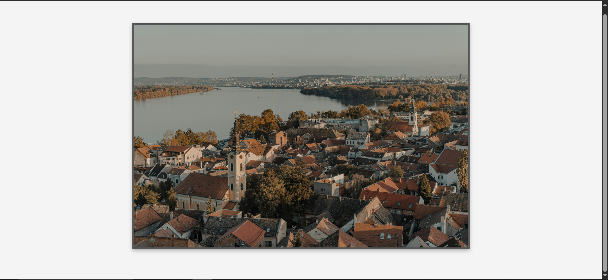

# 🌍 Image Loader Demo

This is a simple JavaScript demo that loads two images using Promises.  
Each image is displayed for 2 seconds and then hidden before the next one is shown.

---



## _Figure 1: Application in Action_

## ✨ Demo

You can view a live demo of this project [here](https://d-vokic.github.io/WhereAmI-geolocation-app/).

---

## Table of Contents

- [Image Loader Demo](#image-loader-demo)
  - [Demo](#demo)
  - [Table of Contents](#table-of-contents)
  - [Technologies Used](#technologies-used)
  - [How to Run](#how-to-run)
  - [Features](#features)
  - [Project Structure](#project-structure)
  - [Author](#author)
  - [License](#license)

## 🧰 Technologies Used

- **HTML** & **CSS** – Page structure and styling
- **Vanilla JavaScript (ES6+)** – Core logic and DOM manipulation
- **DOM manipulation** – To handle asynchronous operations
- **Promises**:
  - Handles asynchronous image loading using `Promise`
  - Resolves when image is loaded, rejects on error
  - Uses `.then()` chaining for sequence and `.catch()` for error handling

---

## 🌐 How to Run

1. Clone or download this repository.
2. Place two images in the `img/` folder:
   - `img-1.jpg`
   - `img-2.jpg`
3. Open `index.html` in your browser.

---

## 📦 Features

- Dynamic image loading
- Error handling for missing images
- Basic fade transition (optional via CSS)

---

## 📁 Project Structure

```
where-am-i/
├── img/
│ ├── img-1.jpg
│ └── img-2.jpg
├── index.html        # HTML skeleton
├── style.css         # Basic styling for the app
├── script.js         # Main JavaScript logic (with fetch and DOM rendering)
├── .prettierrc       # Configuration file for Prettier code formatter
├── .gitignore        # Specifies files and folders to be ignored by Git
├── screenshot.png    # Screenshot showing the application in action
├── LICENSE.md        # License information for the project
└── README.md         # Project documentation
```

## 👨‍💻 Author

#### [Dusko Vokic](https://duskovokic.com)

**Test Technician & Front-End Developer**  
Passionate about learning and improving skills in JavaScript and web development.

## License

This project is licensed under the MIT License - see the [LICENSE.md](LICENSE.md) file for details
